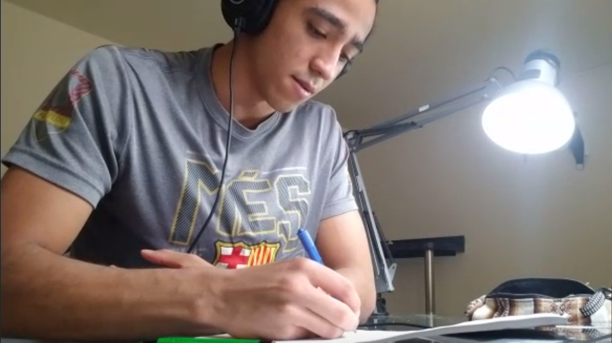
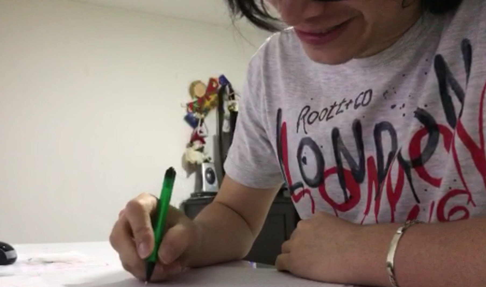
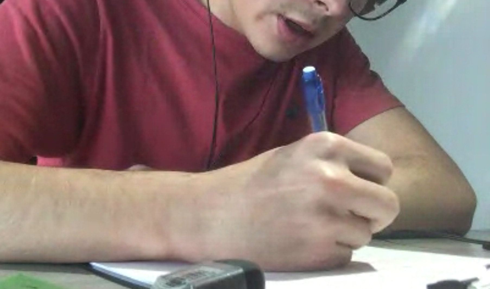
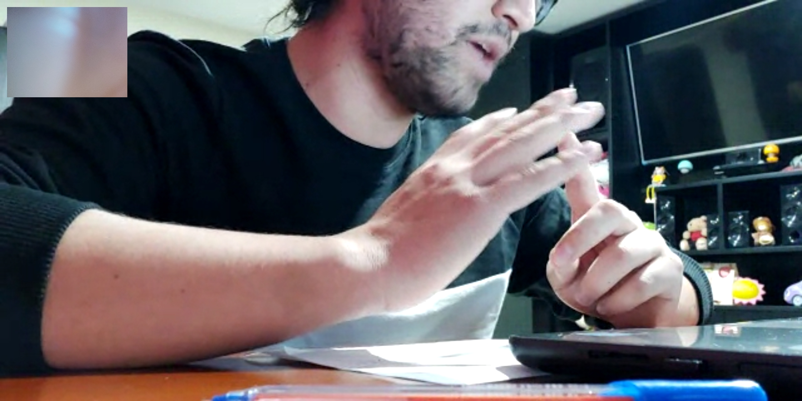
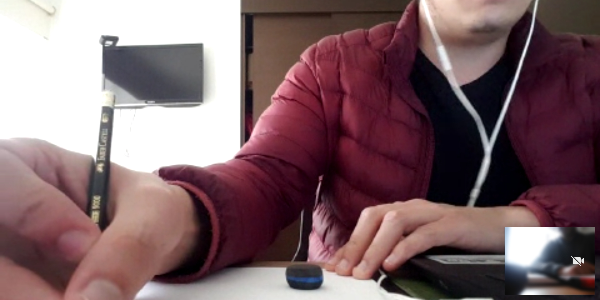
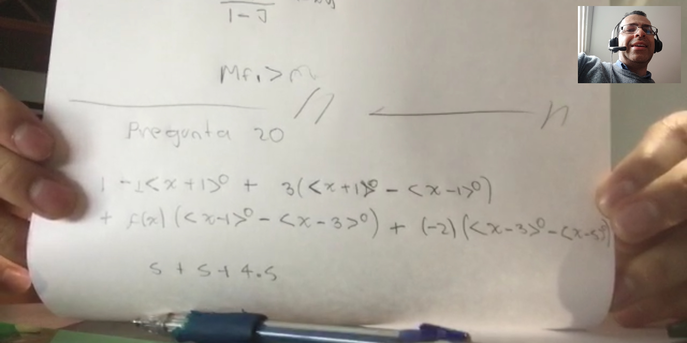
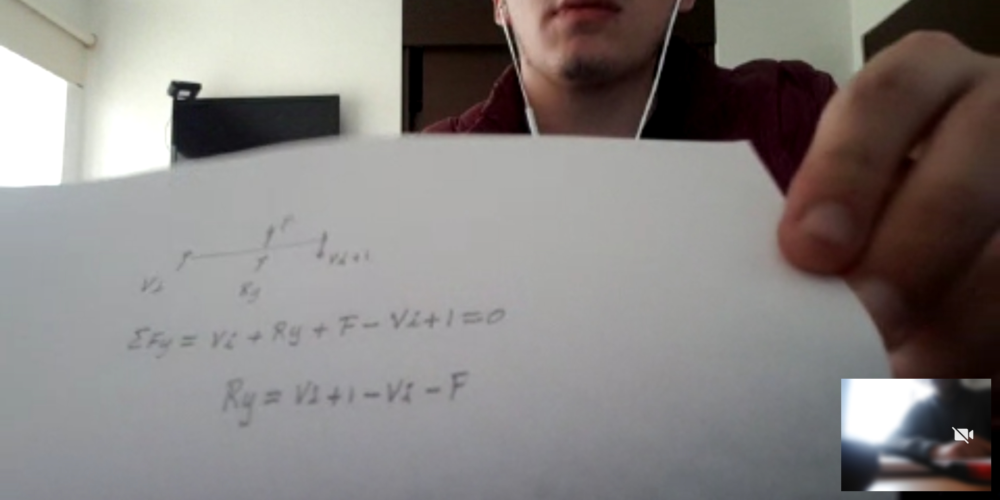
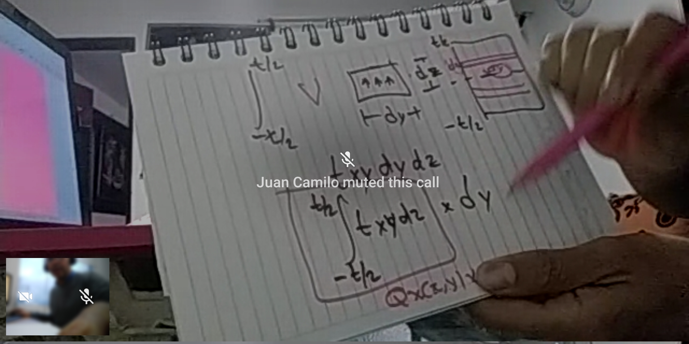

# Protocolo para la presentación del examen oral

Dado que la Universidad Nacional de Colombia no tiene un protocolo propio para la presentación de exámenes orales en línea, se utilizará el siguiente, el cual está basado en algunos utilizados en otras universidades durante esta eventualidad del COVID-19, tal y como figura en los siguientes enlaces:

* [Universidad de Bologna - Italia](https://www.unibo.it/en/services-and-opportunities/online-services/online-services-for-students-1/lessons-and-exams-online)
* [Universidad de Roma - Italia](https://en.uniroma2.it/news/coronavirus-update-13-online-oral-exams-procedure/)
* [Pontificia Universidad Católica del Perú](http://files.pucp.edu.pe/facultad/generales-letras/wp-content/uploads/2018/07/30152912/Protocolo-para-la-realizaci%C3%B3n-de-ex%C3%A1menes-orales-en-Estudios-Generales-Letras-vf-1.pdf)
* [Universidad Nacional de Rosario - Argentina](https://www.fder.unr.edu.ar/wp-content/uploads/2020/06/575-20_compressed.pdf)
* [University College Cork - Irlanda](https://www.ucc.ie/en/skillscentre/preparingforexams/preparationforonlineoralexams/)
* [VIA University College - Dinamarca](https://en.via.dk/coronavirus/oral-exams-skype)
* [Universidad de Copenhagen - Dinamarca](https://itustudent.itu.dk/study-administration/exams/online-oral-exams)

## Pautas para la realización del examen
* El examen se presentará de manera individual y sincrónica utilizando [MICROSOFT TEAMS](https://teams.microsoft.com/) en el computador y WhatsApp en el celular.

* El estudiante requerirá de una mesa o escritorio, un computador con una cámara conectada a internet, su celular como segunda cámara, micrófono y parlantes. La cámara del computadore deberá estar filmando la cara del estudiante. La cámara del celular se deberá colocar de modo que muestre las manos del estudiante, la hoja donde raya y su escritorio. Ejemplos:

<!---

--->

* El estudiante solicitará a su familia o sus compañeros de casa que no sea interrumpido durante la presentación del examen.

* El examen se presentará en una habitación cerrada, donde ninguna otra persona estará presente. Al inicio del examen, el estudiante mostrará a la cámara su documento de identidad y el carnet estudiantil, de modo que pueda ser identificado por el profesor.

* El estudiante estará sentado en una silla y se ubicará delante de la cámara. Solo podrá pararse si el profesor lo autoriza.

* El estudiante procurará que el lugar esté aislado de ruidos y tenga buena iluminación.

* Durante el examen y en cualquier momento, el profesor podría solicitar al estudiante que muestre con su cámara, y en 360 grados, la habitación donde se encuentra para demostrar que se encuentra solo.

* Como podrían existir retrazos en los exámenes orales, usted deberá esperar a que el profesor lo contacte. Para tal fin esperará al llamado del profesor con el programa MICROSOFT TEAMS abierto.

* Sobre el escritorio donde se presentará el examen solo debe estar el computador o portátil. No habrán apuntes, libros, notas pegadas en la pared, o adheridos o apoyados en algún lugar. Solo se tendrá portaminas (o lápiz), borrador y una hoja en blanco, en la cual el estudiante podría rayar cosas en caso que lo requiera. Ese papel lo presentará a la cámara para mostrar los gráficos, esquemas o ecuaciones que requiera para hacerse entender. En caso que el profesor lo solicite, esa hoja deberá marcarse con el nombre e inmediatamente después de concluir la serie de preguntas, deberá enviar una foto de la hoja al correo del profesor.

Mostrando la hoja del examen

   

* El estudiante cederá el control del computador al profesor. En el computador deberá estar abierto el archivo texto guía del curso. Una vez sorteada la pregunta, el profesor se dispondrá a ubicar la sección del texto que se evaluará. El estudiante no podrá usar el computador, a menos que el profesor lo permita. Esto es con el fin de que el profesor ubique el gráfico o la ecuación sobre la cual se harán las preguntas del examen, y pueda ocultar la información que no quiere que el estudiante vea.

* Durante el examen la cámara y el micrófono estarán permanentemente abiertos. Nunca podrá silenciarse el micrófono y/o apagarse la cámara.

* Mientras responda la pregunta de forma oral, el estudiante deberá mirar fijamente a la cámara del computador.

* El examen será grabado por parte del profesor y usando Microsoft Teams y/o el programa OBS. Esta será la evidencia que se utilizará en caso de reclamos. 

* Dado que el curso tiene un texto guía, el examen consistirá en seleccionar una sección al azar del texto y preguntar sobre la misma. Para ello, el profesor distribuirá entre los estudiantes un cuestionario, el cual estará basado en el libro guía de la materia. De dicho cuestionario se seleccionará al azar una pregunta, la cual se sorteará utilizando cualquier página WEB que genere números aleatorios (en GOOGLE aparece uno cuando se escribe "*random number generator*"). Las preguntas que aparecen en el cuestionario solo serán unas que faciliten la evaluación. El profesor podría hacer preguntas diferentes a las que están en el cuestionario, pero deberán estar relacionadas con la sección del libro que se está evaluando. En caso que vuelva a seleccionarse la misma sección del libro, se repetirá el sorteo.

* El examen durará a lo más 20 minutos. En este tiempo se harán mínimo 3 preguntas y máximo 5 preguntas. Todas las preguntas tendrán la misma ponderación. Este tiempo incluirá la calificación y retroalimentación.

* Cualquier anormalidad referida al espacio, ingreso de personas o interrupciones de terceros que no sean justificadas implica la interrupción inmediata del examen. Interrupciones involuntarias como que alguien abre involuntariamente la puerta, no entra a la habitación e inmediatamente la cierra, no son causas válidas para la interrupción del examen.

## Otros consejos
* Like in an in-person oral exam, be punctual and perhaps even be online 15 minutes before the exam to make sure your internet connection works well

* Familiarise yourself with the format and requirements of the oral exam and know what to prepare for it in advance: which programmes/software/apps do you need? Do you have them? Are they working properly?

* Ensure in advance that you have working web camera, mobile phone, microphone and internet connection; make sure they all work and are charged for the online session

* Try calling a classmate, friend or family member to try out that everything works, e.g. your microphone and speakers or your headset

* Practice presenting and speaking in front of other people before your oral exam, e.g. video-call classmates or friends to become more confident about how you sound, look and how it feels to speak through the microphone and in front of the camera

* Remember: it is OK to be nervous; examiners know this, and they will try and help you feel to feel comfortable in this challenging situation and your nerves will calm down after a few minutes

* Before the oral exam, make sure to have a bottle of water nearby and have a bite to eat in advance so you are not hungry during the exam

* Se recomienda mirar en YouTube videos de como prepararse para un examen oral. Esto le dará confianza, y probablemente tranquilidad.

## Criterios de calificación
* Dado que la evaluación oral puede ser algo subjetiva, se indica la siguiente escala, la cual puede dar una idea de la evaluación a una pregunta dada.
   - 5.0 Se demuestra total dominio y seguridad del tema evaluado.
   - 4.0 Se demuestra dominio del tema evaluado, pero algunos aspectos clave han sido olvidados o ha suministrado respuestas incorrectas.
   - 3.0 Si el estudiante responde algunas cosas, correctamente otras incorrectamente y no menciona otros temas clave.
   - 2.0 Solo se conoce el tema superficialmente.
   - 1.0 Si el estudiante se muestra demasiado dubitativo en la respuesta; no hay fluidez en la respuesta, hay gran incertidumbre, una demora excesiva para responder.
   - 0.0 El estudiante desconoce completamente el tema a evaluar; el estudiante responde sin mirar fíjamente a la cámara, dando a pensar que está leyendo algún texto. 

* Para la calificacíon se tendrá en cuenta:
  - Conocimiento y comprensión del tema que se evalúa
  - Capacidad para interactuar con el profesor y sostener un diálogo sobre el tema que se evalúa
  - The student’s behavior will be closely monitored: for the outcome of the examination, it will be evaluated whether (s)he denotes distraction from the monitor or excessive uncertainty or slow response.

* Si en algún momento el estudiante hace trampa o no sigue el protocolo, se tendrá una nota de 0.0.

* Al final del examen, el profesor le informará al estudiante su nota.

* Las preguntas que hará el profesor intentarán determinar habilidades de pensamiento de orden superior como: comprender, aplicar, analizar, evaluar o crear.

## En caso de falla de la comunicación o de problemas técnicos
* El estudiante tendrá tres intentos para presentar el examen.

* En caso que no pueda presentarse al examen, por favor avíselo previamente, con justificación válida, conforme al reglamento de la universidad (por ejemplo, excusa médica). En este caso, el profesor reagendará el examen.

* De no poder concretarse la comunicación, se considerará que el estudiante estuvo ausente y habrá consumido uno de los tres posibles intentos para presentar el examen. 

* If the exam is interrupted due to technical issues and the connection is not quickly restored, you must call the examiner from your phone. You must always be the one to make the call, even if the problems are not at your end - and you must do it without unnecessary delay. The examiner will decide whether the exam is be continued, discontinued or postponed – and you will be told before you hang up the phone, what is going to happen next.

* If the duration of the interruption caused by technical problems corresponds to less than 1/5 of duration of the exam, the examiner will add the time spent re-establishing communications to the exam. 

## If the exam cannot be completed
* If you cannot complete the exam due to technical issues with your equipment or the internet connection is failing at your end, you will have used one exam attempt, just as you would if you were delayed going to an oral exam because the bus was delayed or your bike had a flat tyre.

* That said, it is an extraordinary situation and it will be taken into consideration if you would end up needing to ask for a dispensation for a fourth attempt.

* In case the exam cannot be completed due to other factors than those, that you are responsible of, a new exam will be offered as soon as possible in order to repair the situation. In that case, the interrupted attempt to do the exam will not count as one of your three exam attempts.

* Si en ninguno de los tres intentos se pudo completar el examen, la nota obtenida en el examen será 0.0.
