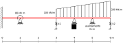

# Taller de vigas: comparación de las teorías de Euler-Bernoulli y Timoshenko-Ehrenfest

Con el objeto de contrastar la teoría aprendida y la práctica mediante el uso de un software profesional de análisis estructural, se requiere hacer el análisis de los desplazamientos, diagramas de momento flector y de fuerza cortante en una viga, utilizando las teorías de Euler-Bernoulli y de Timoshenko-Ehrenfest. Se espera que el estudiante explore, comente, discuta los conceptos aprendidos en clase, los conceptos nuevos vistos en el software y que proponga soluciones a los problemas propuestos.

Trabajo de elaboración individual

Fecha de entrega: junio 7, 2020 a las 23:59. Por cada día de retraso se tendrán -0.3 unidades en la nota final.

## El problema propuesto
Considere la viga mostrada:

Dicha viga tiene una sección rectangular de 5 cm de ancho y 25 de alto y está hecha de un material con un módulo de Young E = 20 GPa y un coeficiente de Poisson ν = 0.30. Asuma k1 = k2 = 1000 kN/m.

Se solicita calcular y graficar los diagramas de:
* Fuerza cortante
* Momento de flexión
* Ángulo de giro de la viga
* Desplazamiento vertical

Utilizando los siguientes métodos:
* Diferencias finitas por el método de Euler-Bernoulli
* Funciones de discontinuidad con las teorías de Euler-Bernoulli y la de Timoshenko
* Programa de análisis estructural que usted registró en http://solidos2020a.shoutwiki.com/wiki/Software_para_an%C3%A1lisis_estructural_por_elementos_finitos utilizando las teorías de Euler-Bernoulli y Timoshenko. NOTA: no usar como software el FTOOL.

## Lo solicitado en el informe
Hacer un informe donde se:
* Analice empotramiento de Timoshenko suave y rígido.
* Compare todas las las respuestas (la solución obtenida con el método de las funciones de discontinuidad se considera matemáticamente exacta, por la será el valor de referencia); recuerde hacer cálculos de los porcentajes de error para mirar las diferencias entre las respuestas. 
* Haga diagramas que comparen los resultados obtenidos entre ambas teorías de vigas. ¿Cuál método calculó las reacciones, momentos de flexión, fuerzas cortantes y desplazamientos más altos y más pequeños? 
* Liste en el informe las hipótesis empleadas en la simulación y sus observaciones.
* Configure su software de modo que se emplee la misma convención para mostrar los diagramas de fuerzas cortantes y momentos flectores empleados en clase. Los momentos son positivos cuando la fibra a tracción está a compresión. El eje dependiente M(x) se grafica hacia arriba.

## Material a entregar
Lo solicitado se debe subir a la plataforma GOOGLE CLASSROOM en formato PDF. Los videos se deben subir a YouTube y se deben enlazar en GOOGLE CLASSROOM.

* Hacer un video de no más de 30 minutos donde se haga una revisión crítica de las capacidades teóricas y las hipótesis fundamentales que hace el programa en cuanto al análisis de vigas. OJO: no es mostrar como se utiliza el software, sino más mirar los manuales de referencia del mismo y mostrar que teorías, hipótesis, suposiciones, capacidades y limitaciones que tiene el programa escogido. Entregar, adicionalmente, el archivo PDF utilizado en la presentación de este video. En ese PDF se pueden incluir pantallazos de los manuales de referencia del software escogido.
* Hacer un video de no más de 15 minutos que ilustre como resolvió la viga utilizando el programa seleccionado. En el mismo video mostrar la comparación de los resultados obtenidos con MAXIMA y con el programa escogido. 
* Informe del trabajo con el análisis de resultados.
* Envíe, adicionalmente, los archivos de MAXIMA, EXCEL y del software empleado asociados a este ejercicio.

Active en el software de captura de pantalla la opción para ver el ratón.

## Criterios de evaluación
* Análisis y comparación de los resultados con diferencias finitas, funciones de singularidad y el software de EFs: 60%.
* Revisión crítica de las capacidades teóricas y las hipótesis fundamentales que hace el programa en cuanto al análisis de viga: 40%.
* Nota máxima 6.0
* Por mala calidad en el sonido se rebajarán 0.5 unidades. Por favor use un micrófono (por ejemplo, usar el manos libres) para hacer el video.
