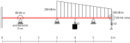

# Taller de vigas: comparación de las teorías de Euler-Bernoulli y Timoshenko-Ehrenfest

Con el objeto de contrastar la teoría aprendida y la práctica mediante el uso de un software profesional de análisis estructural, se requiere hacer el análisis de los desplazamientos, diagramas de momento flector y de fuerza cortante en una viga, utilizando las teorías de Euler-Bernoulli y de Timoshenko-Ehrenfest. Se espera que el estudiante explore, comente, discuta los conceptos aprendidos en clase, los conceptos nuevos vistos en el software y que proponga soluciones a los problemas propuestos.

Trabajo de elaboración en parejas.

Fecha de entrega: se especificará en GOOGLE CLASSROOM. Por cada 8 horas día retraso se descontará una décima de la nota final.

## El problema propuesto
Considere la viga mostrada:

Dicha viga tiene una sección rectangular de 5 cm de ancho y 25 de alto y está hecha de un material con un módulo de Young *E* = 20 GPa y un coeficiente de Poisson *ν* = 0.30. Asuma *k₁* = *k₂* = 1000 kN/m.

Se solicita calcular y graficar los diagramas de:
* Fuerza cortante *V(x)*
* Momento de flexión *M(x)*
* Ángulo de giro de la viga *dv(x)/dx*
* Desplazamiento vertical *v(x)*
* Variación de los esfuerzos *σₓ(y)* y *τₓᵧ(y)* en diferentes secciones transversales de la viga.

Utilizando los siguientes métodos:
* Funciones de discontinuidad con las teorías de Euler-Bernoulli y la de Timoshenko-Ehrenfest
* Programa de análisis estructural que usted registró en GOOGLE CLASSROOM utilizando las teorías de Euler-Bernoulli y Timoshenko-Ehrenfest. NOTA: no usar como software el FTOOL.
* Método de los elementos finitos 2D (tensión plana)

## Se solicitado
* Un archivo PDF, **elaborado por todos los integrantes del grupo**, que contenga un informe donde:
  * Considere las soluciones calculadas mediante funciones de discontinuidad como la solución matemáticamente exacta, por lo que esta será el valor de referencia para comparar otras las respuestas.
  * Analice empotramiento suave y rígido y la teoría de Timoshenko-Ehrenfest. Compare ambas respuestas entre sí.
  * Compare la solución utilizando la teoría de Euler-Bernoulli con la
    solución obtenida con el software profesional contra la solución obtenida con el método de las funciones de discontinuidad; recuerde hacer cálculos de los porcentajes de error para mirar las diferencias entre las respuestas.
  * Realizar el punto anterior pero esta vez utilizando la teoría de Timoshenko-Ehrenfest.
  * Estime el porcentaje de diferencia estimada por las teoría de Euler-Bernoulli y Timoshenko-Ehrenfest estimada con el método de las funciones de discontinuidad.
  * Haga diagramas que comparen los resultados obtenidos entre ambas teorías de vigas. ¿Cuál método calculó las reacciones, momentos de flexión, fuerzas cortantes y desplazamientos más altos y más pequeños? 
  * Liste en el informe las hipótesis empleadas en la simulación y sus observaciones.
  * Configure su software de modo que se emplee la misma convención para mostrar los diagramas de fuerzas cortantes y momentos flectores empleados en clase. Los momentos son positivos cuando la fibra a tracción está a compresión. El eje dependiente *M(x)* se grafica hacia arriba.
  * Explique qué es lo que observa en los gráficos.
  * Compare las respuestas calculadas con el método de las funciones de discontinuidad y la solución obtenida con el método de los EFs para tensión plana; recuerde hacer cálculos de los porcentajes de error para mirar las diferencias entre las respuestas. Realice un estudio similar al mostrado en la Sección 9.2 del `main.pdf`, en los que se compare:
    * *v(x,0)* calculado con el método de los EFs 2D con el desplazamiento vertical *v(x)* estimado con las teorías de EB y TE.
    * *v(x,y)*, *σₓ(x,y)* y *τₓᵧ(x,y)* calculado con el método de los EFs 2D con el  estimado con las teorías de EB y TE para los siguientes *x*:
       * Grupo 1: *x* = 0.05 m y *x* = 2.00 m
       * Grupo 2: *x* = 3.50 m y *x* = 4.99 m
       * Grupo 3: *x* = 5.50 m y *x* = 5.99 m
       * Pablo Teixeira:   *x* = 1.00m
    * Se calcule la fuerza cortante *V(x)*, el momento flector *M(x)* y la fuerza axial *P(x)* para diferentes puntos de la viga con el método de los EFs 2D y con el estimado con las teorías de EB y TE. Para tal fin se deben emplear las ecuaciones:
<!---
Compile en: https://tex.s2cms.com

\begin{align*}
V(x) &= - \iint_{A(x)}   \tau_{xy}(x,y,z) \operatorname{d} y \operatorname{d} z \\
M(x) &= - \iint_{A(x)} y \sigma_{x}(x,y,z) \operatorname{d} y \operatorname{d} z \\
P(x) &= + \iint_{A(x)}   \sigma_{x}(x,y,z) \operatorname{d} y \operatorname{d} z 
\end{align*}
--->
 %20%26%3D%20-%20%5Ciint_%7BA(x)%7D%20%5Ctau_%7Bxy%7D(x%2Cy%2Cz)%20%5Coperatorname%7Bd%7D%20y%20%5Coperatorname%7Bd%7D%20z%20%5C%5C%0AM(x)%20%26%3D%20-%20%5Ciint_%7BA(x)%7D%20y%20%5Csigma_%7Bx%7D(x%2Cy%2Cz)%20%5Coperatorname%7Bd%7D%20y%20%5Coperatorname%7Bd%7D%20z%20%5C%5C%0AP(x)%20%26%3D%20%2B%20%5Ciint_%7BA(x)%7D%20%5Csigma_%7Bx%7D(x%2Cy%2Cz)%20%5Coperatorname%7Bd%7D%20y%20%5Coperatorname%7Bd%7D%20z%20%0A%5Cend%7Balign*%7D)
  * Las fórmulas anteriores se pueden evaluar usando en el software una opción llamada "Integrate over surface".

  * No es necesario escribir una introducción o un marco teórico que contenga la metodología vista en clase.

* **Cada integrante del taller debe hacer** dos videos:
  * VIDEO 1 (máximo 20 minutos): hacer un video que ilustre como resolvió la viga utilizando el programa seleccionado con EFs de pórtico y de tensión plana. En el mismo video mostrar, en máximo 3 minutos, la comparación de los resultados obtenidos con MAXIMA y con el programa escogido (usando las teorías de EB, TE y el método de los EFs para tensión plana).

  * VIDEO 2 (máximo 20 minutos): en este video se debe hacer una reseña crítica de las capacidades teóricas y las hipótesis fundamentales que hace el programa en cuanto al **ANALISIS DE VIGAS Y PÓRTICOS** (es decir, en cuanto a la matemática interna para el cálculo de desplazamientos, diagramas de momento flector, fuerza cortante, etc). OJO: no es mostrar como se utiliza el software, sino más mirar los manuales de referencia y mostrar que teorías, hipótesis, suposiciones, capacidades y limitaciones que tiene el programa escogido y que se utilizaron para calcular la viga. Entregar, adicionalmente, el archivo PDF utilizado en la presentación de este video. Se sugiere para la presentación tomar capturas de pantalla de los manuales de referencia del programa en cuestión. OJO: no confunda esto con la información comercial. Lo que se está solicitando está dentro de los manuales de referencia. Algunos ejemplos de buenos análisis son:
     * MIDAS GEN (análisis de vigas): https://www.youtube.com/watch?v=p06pnzg2ZPg
     * STRUSOFT FEM-DESIGN (análisis de losas): https://www.youtube.com/watch?v=xxPzgIl-mEg

* Se solicita subir todos los archivos asociados al trabajo (.XLSX, .DOCX, .MP4, .MKV, archivo de MAXIMA, etc) directamente a GOOGLE CLASSROOM. Por favor no los empaquete en un archivo .ZIP o .RAR.

* Active en el software de captura de pantalla la opción para ver el ratón.

Se espera que cada uno lea a fondo el manual del usuario del software. No se queden con los videos de YouTube. En el manual del usuario generalmente existe información importante sobre las hipótesis de modelado que hace cada software.

Se sugiere aprender a manejar un programa de edición de videos. Esto les facilitará grandemente la realización del video.

## Criterios de evaluación
* NOTA MAXIMA 6.0

* Análisis y comparación de los resultados, funciones de singularidad y el software de EFs (60% = 3.6)
  * 0.2 Calculo de reacciones, *V*, *M*, *θ*, *v* con MAXIMA + funciones de singularidad + EB
  * 0.3 Calculo de reacciones, *V*, *M*, *θ*, *v* con MAXIMA + funciones de singularidad + TE (empotramientos suave y duro)
  * 0.9 VIDEO 1: Calculo de reacciones, *V*, *M*, *θ*, *v* con el software profesional haciendo un ingreso adecuado de datos. Comparar contra:
     * Método de las funciones de singularidad + EB
     * Método de las funciones de singularidad + TE
     * Método de los EFs para tensión plana
  * Si no se realiza el video 1, se tendrá -2.0 unidades.
  * 0.5 Compara, analiza, hace tablas y/o gráficas comparativas de los resultados entre los diferentes métodos que usan la teoría de Euler-Bernoulli. ¿Explica el por qué de las diferencias?
  * 0.6 Compara, analiza, hace tablas y/o gráficas comparativas de los resultados entre los diferentes métodos que usan la teoría de Timoshenko-Ehrenfest y calcula el porcentaje de diferencia entre los resultados para los diferentes tipos de empotramientos. ¿Compara respuestas entre los diferentes empotramientos de Timoshenko (rígido/suave) y el software? ¿Explica el por qué de las diferencias?
  * 0.5 Compara, analiza, hace tablas y/o gráficas comparativas de los resultados entre el método de EB y el de TE estimados por el método de las funciones de singularidad? ¿Explica el por qué de las diferencias?
  * 0.6 Compara, analiza, hace tablas y/o gráficas comparativas de los resultados entre el método de los EFs para tensión plana y por el método de las funciones de singularidad? ¿Explica el por qué de las diferencias?

* VIDEO 2: reseña crítica de las capacidades teóricas y las hipótesis fundamentales que hace el programa en cuanto al análisis de vigas (40% = 2.4)
  * 0.8 Hace un recuento de las teorías que soporta el programa, haciendo recortes del manual de referencia. Explica capacidades de cálculo y teorías que utiliza el software. 
  * 0.8 Explica hipótesis fundamentales y consejos en el modelado según se detalla en el manual del programa; hace una reseña crítica de las capacidades teóricas, las limitaciones y las hipótesis fundamentales que hace el programa en cuanto al análisis de viga
  * 0.8 Hace una reseña crítica de las ventajas/capacidades y limitaciones/suposiciones que hace el programa en cuanto al análisis de vigas y pórticos

* Por mala calidad en el sonido se rebajarán 0.5 unidades. Por favor use un micrófono auxiliar (por ejemplo, un manos libres) y evite usar el micrófono del portátil para hacer el video.

* Si se sube un video de mala calidad (por ejemplo 720p de calidad o inferior) se rebajará 1.0 unidad. Mínimo 1080p. Recuerde que no tenemos limitación en el almacenamiento en GOOGLE CLASSROOM. En caso que su equipo no sea capaz de hacer videos con resolución 1080p, infórmelo previamente.

* Si se usa un software diferente al registrado, se tendrá menos 2.0 unidades.

* Si no se incluye en el video un recuadro donde se donde se vea usted hablando sobre el software se tendrá menos 3.0 unidades. En caso de que no tenga cámara de video podría utilizar aplicaciones como [DroidCam](https://play.google.com/store/apps/details?id=com.dev47apps.droidcam) o [DroidCam OBS](https://play.google.com/store/apps/details?id=com.dev47apps.obsdroidcam), con los cuales se puede utilizar su celular como cámara para el computador.
